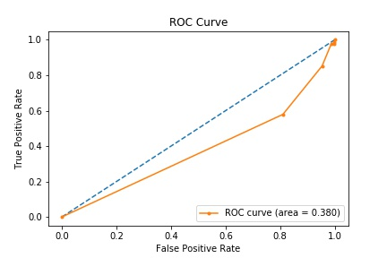
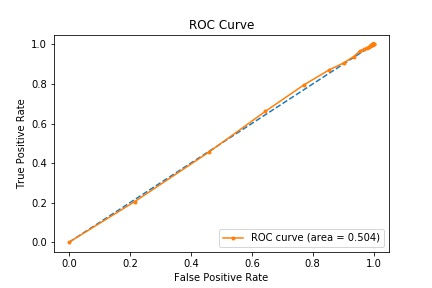
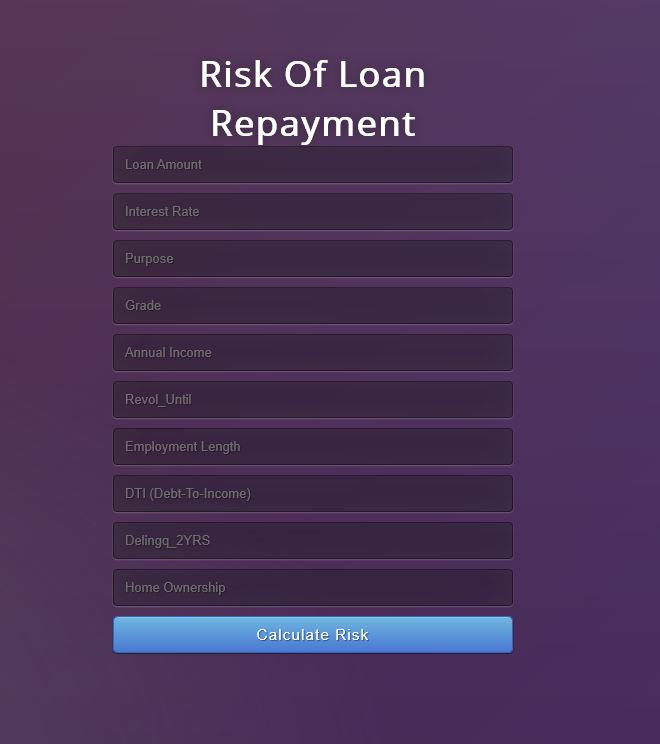

# phData MLE Challenge Project
*An application that predicts whether loan holders are at risk of late payment using a risk assessment.*

### Objective
Objective of this proejct is to demonstrate deploying a machine learning model into production using a REST API after building a ml model. 
phData MLE-Challenge has given a dataset, pre-built model and other environemnt set up to run pre-built model.

### Tasks:
* Task 1: Explore and run pre-built model with given data and deploy the model into a REST API that allows users to POST data and obtain predictions.
* Task 2:Improve given model (I tried a different model) and deploy into a REST API where multiple users can use API resources without service interruption.

### My Approach
##### Task 1:
The model provided in in the challege was deployed locally using Flask REST API in an Anaconda virtual environment. A web template with a form was used, so that a user can enter values, which are model features into the form
and get prediections as output. Flask application uses a predict function, which uses the pickled model from local folder that gives predictions for "POST" method. These are done within the virtual environment itself.

##### Task 2:
The purpose of the following steps are to improve exisitng randomforest classification model and deploy it to the REST API. After a quick data exploration, since the data seemed little imbalanced with more of the positive outcome variables and less of negative 
outcome variables. However, given trainig and test datset was combined together, shuffled and divided into 80:20 train and test sets althouugh this approcah did not make a big difference. Accuracy is not a good measure 
as data is imbalanced and ROC-AUC curve was slight more than 50% which always would positive results (0 in our case) for a randomly selected sample (i.e test/unseen data).
to improve the model, hyperparameter of the model was tuned (n_estimators were increased from default 10 up to 100. This time the AUC went higher from 0.380 to 0.504. This model was re-deployed into the production.

###### Original ROC-AUC

###### Slightly Improved ROC-AUC

In order to deploy the model that can be used by many users, a PaaS (platform as a service) style architecture was used with Heroku. This serves the model into the world wide web using python flask application. Since Heroku works connecting to 
github updates of the models can be re-deployed by committing model changes since Flask will continue to use the saves model. It will be much nicer, if this model can be deployed into AWS or Azure with docker (different versions containerrized)
into the cloud as IaaS (infrastrucure as service), which will enable many users to access the REST API without stopping the service.

##### Challenges:
Although Docker was recommeneded, installing docker in a virtual box (windows 10 home) and mounting to a disk was time consuming for configuration and debugging.

Saving user data input into a database and use them for future model training to kepp updating the model since database configurations are needed and they have to sync with the web application.

Different versions of models cannot be deployed without interrupting the service with the current architecture.

##### Suggested Improvements:
As mentioned above, deploying into cloud such as AWS with Docker and Kubernetes to orachestrate the workflow wihtout interrupting the service.

Hyper parameter optimization using `gridserachcv` techniques to optimize the model.

##### Run the Updated Model Locally
Assuming  - anaconda in Windows 10. Redeployment of improved model can be run in a conda virtual environment. 

Follow this step to install using YML file, otherwise skip to the next section to create venv.In anaconda propmt run the following (file is in <env-setup> folder). 
`conda env create -f environment.yml`

cerate a virtual envirnment using (please use a different name if that name is already exists)
`conda create -n loanmodel`

Activate environemnt
`conda activate loanmodel`

Next, install required packages from requirements.txt 
`conda install --file requirments.txt`

Next, making sure you're in the right folder type
`python app.py`

This should open up a browser, whichever is the default will open flask application (usually internet explorer in windows).

##### Heroku Proc File

Heroku uses a Proc file which contains the gunicorn library, a webserver (simialr to nginex) that allows Heroku to deploy Flask application into the world wide web.

Proc file and requirments.txt files have to be in the direcotry when dploying the model into Heroku as it installs requires packages into the deploying environment. 

###### Snapshot of the app interface

